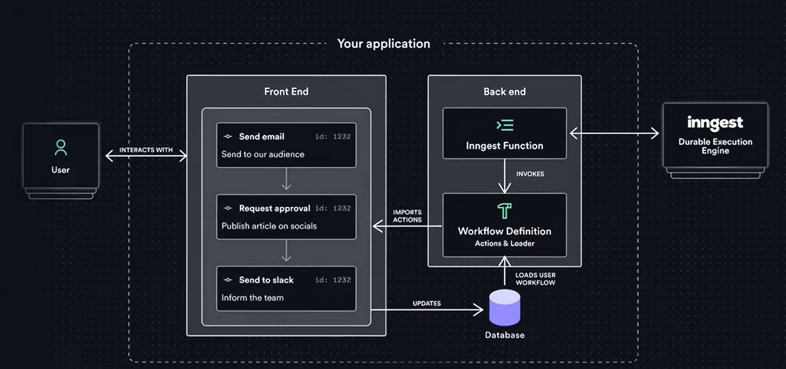

# Signalist (Stock Market App)

A modern, AI-powered stock market tracking application aimed at helping users make smarter investment moves. The app provides personalized market insights, allows users to manage a watchlist of stocks, and delivers daily AI-summarized news emails based on their interests and portfolio.

## 📋 Table of Contents

- [Signalist (Stock Market App)](#signalist-stock-market-app)
  - [📋 Table of Contents](#-table-of-contents)
  - [🚀 Features](#-features)
  - [📂 Project Structure](#-project-structure)
  - [🚀 Getting Started](#-getting-started)
    - [Prerequisites](#prerequisites)
    - [Installation](#installation)
    - [Running the Application](#running-the-application)
  - [⚙️ Tech Stack](#️-tech-stack)
  - [⚙️ Daily news summary workflow](#️-daily-news-summary-workflow)

## <a name="features">🚀 Features</a>

-   **User Authentication**: Secure sign-up and sign-in functionality using Better Auth.
-   **Personalized Onboarding**: Collects user preferences such as investment goals, risk tolerance, and preferred industries to tailor the experience.
-   **Stock Watchlist**: Users can search for and add stocks to their personal watchlist to track performance.
-   **AI-Powered Insights**:
    -   **Welcome Emails**: Personalized welcome emails generated by AI (Gemini) based on user profile.
    -   **Daily News Summaries**: Automated daily emails summarizing relevant market news for stocks in the user's watchlist using AI.
-   **Market Data**: Integration with Finnhub API for real-time stock data and news.
-   **Interactive Charts**: TradingView widget integration for technical analysis.
-   **Responsive Design**: Built with Tailwind CSS and Shadcn UI for a modern, mobile-friendly interface.

## <a name="project-structure">📂 Project Structure</a>

```bash
.
├── app/                  # Next.js App Router pages and API routes
│   ├── (auth)/           # Authentication pages (sign-in, sign-up)
│   ├── (root)/           # Main application pages (dashboard, watchlist)
│   └── api/              # API routes (including Inngest endpoint)
├── components/           # Reusable UI components
│   ├── ui/               # Shadcn UI primitives
│   └── widgets/          # Complex widgets (TradingView, Forms)
├── database/             # Mongoose connection and models
├── lib/                  # Utility functions and core logic
│   ├── actions/          # Server Actions (Auth, Finnhub, Watchlist)
│   ├── inngest/          # Inngest functions and client
│   └── nodemailer/       # Email sending templates and logic
├── public/               # Static assets
└── shared/               # Shared types and constants
```

## <a name="getting-started">🚀 Getting Started</a>

### Prerequisites

-   Node.js (v18+ recommended)
-   MongoDB instance (local or Atlas)
-   Finnhub API Key
-   Gemini API Key (for AI features)

### Installation

1.  Clone the repository:
    ```bash
    git clone https://github.com/your-username/stock-market.git
    cd stock-market
    ```

2.  Install dependencies:
    ```bash
    npm install
    ```

3.  Set up environment variables:
    Create a `.env` file in the root directory and add the required variables (MongoDB URI, API Keys, etc.).

### Running the Application

1.  **Start the Next.js development server:**
    ```bash
    npm run dev
    ```
    The app will be available at `http://localhost:3000`.

2.  **Start the Inngest local development server** (in a separate terminal):
    ```bash
    npx inngest-cli@latest dev
    ```
    The Inngest dashboard will be available at `http://localhost:8288` to monitor and test background jobs.

## <a name="tech-stack">⚙️ Tech Stack</a>

- **[Better Auth](https://www.better-auth.com/)** is a framework-agnostic authentication and authorization library for TypeScript. It provides built-in support for email/password login, social sign-on (Google, GitHub, Apple, and more), and multi-factor authentication, simplifying user authentication and account management.

- **[Finnhub](https://finnhub.io/)** is a real-time financial data API that provides stock, forex, and cryptocurrency market data. It offers developers access to fundamental data, economic indicators, and news, making it useful for building trading apps, dashboards, and financial analysis tools.

- **[Inngest](https://jsm.dev/stocks-inngest)** is a platform for event-driven workflows and background jobs. It allows developers to build reliable, scalable automated processes such as real-time alerts, notifications, and AI-powered workflows.

- **[MongoDB](https://www.mongodb.com/)** is a flexible, high-performance NoSQL database. It stores data in JSON-like documents, supports dynamic schemas, and provides robust features for scalability, replication, and querying.

- **[Nodemailer](https://nodemailer.com/)** is a Node.js library for sending emails easily. It supports various transport methods such as SMTP, OAuth2, and third-party services, making it a reliable tool for handling transactional emails, notifications, and contact forms in applications.

- **[Next.js](https://nextjs.org/docs)** is a powerful React framework for building full-stack web applications. It provides server-side rendering, static site generation, and API routes, allowing developers to create optimized and scalable apps quickly.

- **[Shadcn](https://ui.shadcn.com/docs)** is an open-source library of fully customizable, accessible React components. It helps teams rapidly build consistent, visually appealing UIs while allowing full control over design and layout.

- **[TailwindCSS](https://tailwindcss.com/)** is a utility-first CSS framework that allows developers to build custom, responsive designs quickly without leaving their HTML. It provides pre-defined classes for layout, typography, colors, and more.

- **[TypeScript](https://www.typescriptlang.org/)** is a statically typed superset of JavaScript that improves code quality, tooling, and error detection. It is ideal for building large-scale applications and enhances maintainability.

## <a name="workflow">⚙️ Daily news summary workflow</a>
